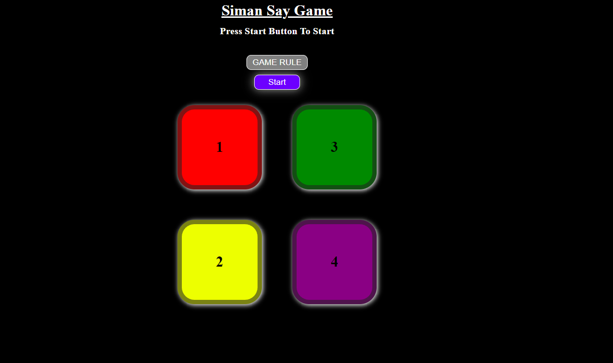
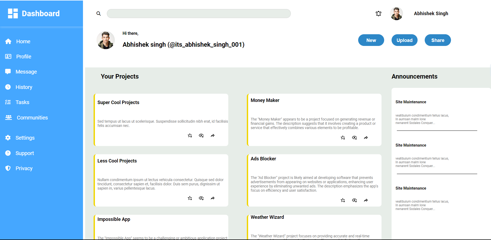

<!-- Header Section -->

  

<h1 align="center">Hello, I'm <a href="https://abhishek-prasad-baheliya.github.io/Portfolio-_website/">ABHISHEK PRASAD BAHELIYA</a> </h1>

  
  

<!-- About Me Section -->

## About Me

I'm a passionate software engineer and web developer with expertise in building scalable web applications and contributing to open-source projects.

### Skills

#### Languages

#### Frameworks

### Database

#### Tools

### Other Technologies

### Interests and Hobbies

- Machine Learning and AI
- Cloud Computing
- Open Source Contribution
- Traveling and Photography
- Alway being ready to learn

<!-- Statistics and Achievements Section -->

## Stats and Achievements

  
  

  

  

<!-- Projects and Contributions Section -->

## Featured Projects

### [Project 1](https://abhishek-prasad-baheliya.github.io/Simon-say-Game-/)

Simon Says: A game where one person, "Simon," gives commands preceded by "Simon says." Participants must follow these commands, but if Simon doesn't say "Simon says" and someone follows the command, they're out. Last person standing wins. Tests listening and memory skills.

### [Project 2](https://abhishek-prasad-baheliya.github.io/Admin-Dashboard/)

The Admin Dashboard is a comprehensive and intuitive platform designed to manage and oversee various projects and tasks efficiently. It provides a user-friendly interface with easy navigation, allowing users to access and manage their profile, messages, project history, tasks, communities, and settings seamlessly. The dashboard also features an announcement section to keep users informed about important updates and site maintenance activities.

### Open Source Contributions

- [Contribution 1](https://github.com/repo/project): Brief description of the contribution.
- [Contribution 2](https://github.com/repo/project): Brief description of the contribution.

<!-- Blog Posts Section -->

## Latest Blog Posts

<!-- BLOG-POST-LIST:START -->

- [Title 1](https://yourblog.com/title1)
- [Title 2](https://yourblog.com/title2)
<!-- BLOG-POST-LIST:END -->

<!-- Contact and Connect Section -->

## Connect with Me

  
  
  

## <!-- Footer Section -->

  <i>“The only way to do great work is to love what you do.” – Steve Jobs</i>

  

